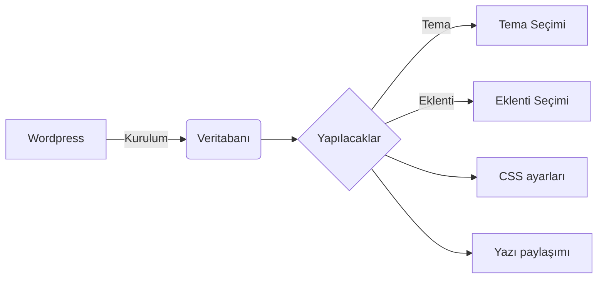

Wordpress sitelerinde kullanılan eklentiler, ayarlar, temalar ve bunlara ilişkin değişimleri nasıl yapacağınızı ve neler yapmanız gerektiğini kısaca açıklayalım. Wordpress siteleri oldukça yaygındır. Kullanımı temelde blog gibi olsa da artık eklentileri ve temaları sayesinde hem forum hem alışveriş siteleri hem kişisel tanıdım siteleri hem de galeri gibi ve çok daha fazlası olacak şekilde kullanılabilir. En çok kullanılan cms sistemlerinden biri haline gelen wordpress için ipuçları ve önemli detayları bu sayfada bulabilirsiniz.

Eğer bir wordpress site kullanıyorsanız çekirdekte ve temalarda değişiklik yapmak yerine size sunulan araçları kullanın. Örneğin analytics kodunu temaya gömmek yerine google site kit eklentisini kullanın. Ve sürekli güncellemeleri yapın. 

